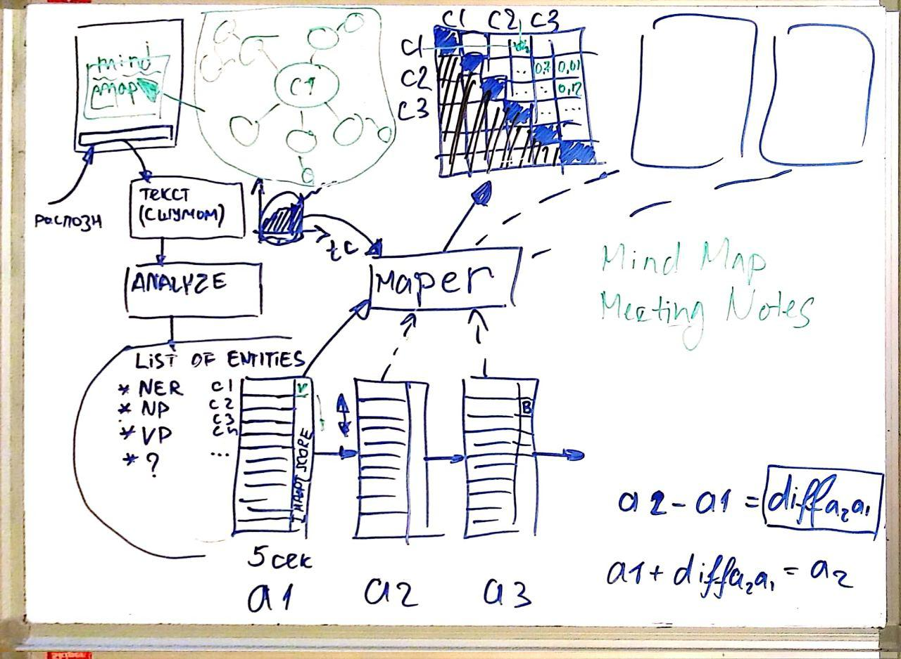

# MM-demo

See [backlog](https://docs.google.com/spreadsheets/d/1uTqkZLnjPkgGWoH3Vkg3unEWrG3S-EqRwAIhGvOchUg/edit?usp=sharing) 



# Running RabbitMQ with Docker
```
docker run -d --hostname my-rabbit --name some-rabbit -p 5672:5672 -p 15672:15672 rabbitmq:3-management
```

# CURL examples

For text sending:
```
curl -H "Content-Type: application/json" -X POST -d '{"text": ["abc erty", "sent2", "cba dfd"]}' http://0.0.0.0:8080/text
```
For result receiving:
```
curl http://localhost:8080/result
```
